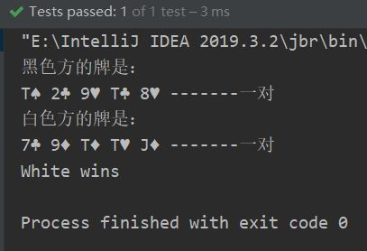
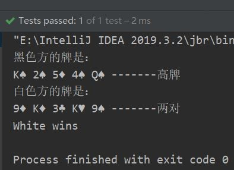
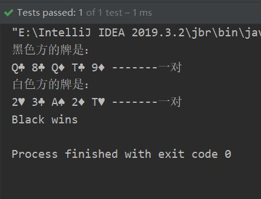
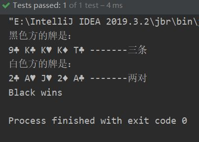
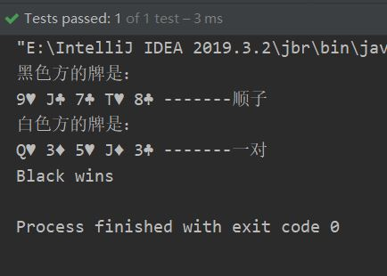
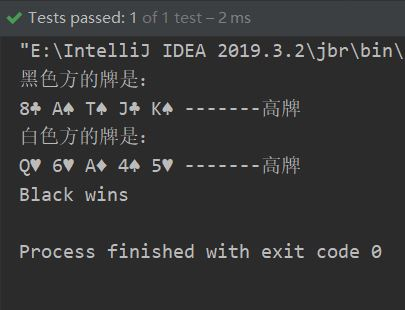
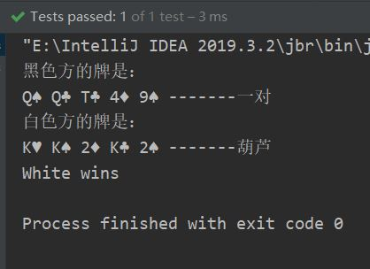

<h3>作业内容</h3>

<h2><!-- react-text: 178 -->中文版<!-- /react-text --></h2>
<!-- react-text: 180 -->一副扑克有52张牌，每张牌由一个花色和一个数字构成。<!-- /react-text -->

<!-- react-text: 182 -->花色为以下四者之一：<!-- /react-text -->
<pre><code class="hljs">方片 D
黑桃 S
红桃 H
梅花 C</code></pre>
<!-- react-text: 186 -->数字为以下13者之一，且大小顺序如下：<!-- /react-text -->
<pre><code class="hljs">2, 3, 4, 5, 6, 7, 8, 9, T, J, Q, K, A</code></pre>
<!-- react-text: 190 -->花色是大小无序的，但数字有序，2最小，A最大。<!-- /react-text -->

<!-- react-text: 192 -->一手牌有5张。根据花色和数字的不同，其大小按照以下规则决定。<!-- /react-text -->

<!-- react-text: 194 -->满足下面规则的手牌会大于满足上面规则的手牌。<!-- /react-text -->
<pre><code class="hljs">同花顺＞铁支＞葫芦＞同花＞顺子＞三条＞两对＞对子＞散牌</code></pre><ol><li>
<!-- react-text: 200 -->散牌：<!-- /react-text -->

<!-- react-text: 202 -->不符合其他任何规则的五张牌。
比较最大一张牌的大小，如果相同，比较第二大的牌的牌点数，如果五张牌的牌点数都相同，则为平局。<!-- /react-text -->
</li><li>
<!-- react-text: 205 -->对子：<!-- /react-text -->

<!-- react-text: 207 -->有两张同样大小的牌片。
比较两张大小一样的牌的牌点数，如果相同，依次比较剩余的三张牌大小。若大小都相同，则为平局。<!-- /react-text -->
</li><li>
<!-- react-text: 210 -->两对：<!-- /react-text -->

<!-- react-text: 212 -->有两个对子牌。
比较大对子的大小，若相同，比较小对子的大小，若还相同，比较单张牌的大小，若还相同，则为平局。<!-- /react-text -->
</li><li>
<!-- react-text: 215 -->三条：<!-- /react-text -->

<!-- react-text: 217 -->有三张同样大小的牌片。
比较三张大小一样的牌的牌点数大小。<!-- /react-text -->
</li><li>
<!-- react-text: 220 -->顺子：<!-- /react-text -->

<!-- react-text: 222 -->五张相连的牌。
比较最大的牌点数。若大小都相同，则为平局。<!-- /react-text -->
</li><li>
<!-- react-text: 225 -->同花：<!-- /react-text -->

<!-- react-text: 227 -->五张牌的花色相同。
按照散排规则比较大小。<!-- /react-text -->
</li><li>
<!-- react-text: 230 -->葫芦：<!-- /react-text -->

<!-- react-text: 232 -->三条+对子。
比较三张大小一样的牌的牌点数。<!-- /react-text -->
</li><li>
<!-- react-text: 235 -->铁支：<!-- /react-text -->

<!-- react-text: 237 -->有四张同样大小的牌片。
比较四张大小一样的牌的牌点数。<!-- /react-text -->
</li><li>
<!-- react-text: 240 -->同花顺：<!-- /react-text -->

<!-- react-text: 242 -->同一种花色的顺子。
比较最大的牌的牌的大小。若大小都相同，则为平局。<!-- /react-text -->
</li></ol>
<!-- react-text: 244 -->你的工作是为两手牌判断大小。<!-- /react-text -->

<!-- react-text: 246 -->例如：<!-- /react-text -->

<!-- react-text: 248 -->输入: 
Black: <!-- /react-text --><code>2H 3D 5S 9C KD</code><!-- react-text: 250 --> White: <!-- /react-text --><code>2C 3H 4S 8C AH</code><!-- react-text: 252 -->
输出: 
White wins<!-- /react-text -->

<!-- react-text: 254 -->输入: 
Black: <!-- /react-text --><code>2H 4S 4C 2D 4H</code><!-- react-text: 256 --> White: <!-- /react-text --><code>2S 8S AS QS 3S</code><!-- react-text: 258 -->
输出: 
Black wins <!-- /react-text -->

<!-- react-text: 260 -->输入: 
Black: <!-- /react-text --><code>2H 3D 5S 9C KD</code><!-- react-text: 262 --> White: <!-- /react-text --><code>2C 3H 4S 8C KH</code><!-- react-text: 264 -->
输出: 
Black wins <!-- /react-text -->

<!-- react-text: 266 -->输入: 
Black: <!-- /react-text --><code>2H 3D 5S 9C KD</code><!-- react-text: 268 --> White: <!-- /react-text --><code>2D 3H 5C 9S KH</code><!-- react-text: 270 -->
输出: 
Tie<!-- /react-text -->
<h2><!-- react-text: 272 -->随机发牌测试结果<!-- /react-text --></h2>
<!-- react-text: 274 -->

